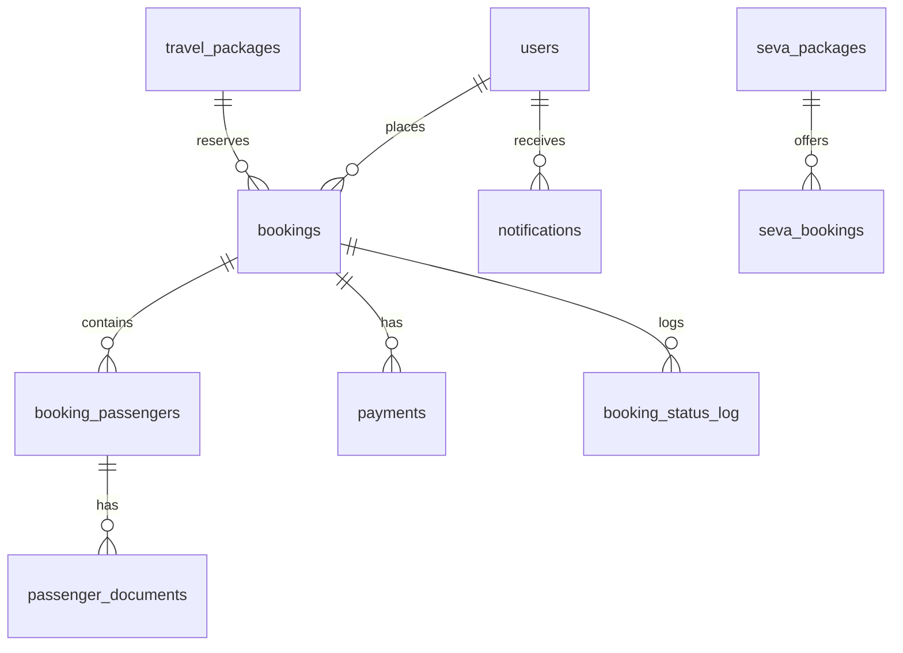

# AUDIT_CURRENT_STATE.md
**Project**: MAVT.IN / Maa Vaishnavi Tourism (Shri Gurudev Ashram Travel)  
**Date of Audit**: September 15, 2026  
**Auditor**: Antigravity AI  

---

## 1. Executive Summary

A comprehensive repository audit of `shri-gurudev-ashram-travel` was performed to assess its current state against the source-of-truth specification: **`MAVT_Detailed_Developer_Requirement_V2.pdf`**.

The current application is a single-booking travel and seva portal designed originally under the working title "Shri Gurudev Ashram Travel". While foundational elements (Express API, Supabase PostgreSQL, Firebase Phone Auth, Razorpay single payments) are in place, **the core operational architecture required by MAVT V2 (Group-centric management, multiple bookings per group, human-readable IDs, installment payments, duplicate UTR protection, train manifest exports, ticket PDF upload/mapping, and room management) is completely absent or only partially sketched.**

---

## 2. Technology Stack Inventory

### Frontend
- **Framework**: React 19.2.6 with Vite 8.0.12 (TypeScript ~6.0.2)
- **Styling**: Tailwind CSS v4.3.1 with custom Indian temple aesthetic theme
- **Routing**: `react-router-dom` v7.15.1
- **State & Data Fetching**: `@tanstack/react-query` v5.101.0
- **HTTP Client**: `axios` v1.18.0 with Bearer token interceptor
- **Internationalization**: `i18next` & `react-i18next` (English, Hindi, Marathi)
- **Authentication Client**: Firebase Phone Auth (`firebase` v12.16.0) with local mock auth support (`VITE_DEMO_AUTH`)
- **Icons & UI Primitives**: `lucide-react`, Radix UI primitives (`@radix-ui/react-*`), `sonner` toasts

### Backend
- **Framework**: Express.js 4.21.2 on Node.js runtime (ESM, TypeScript via `tsx`)
- **Database Client**: `@supabase/supabase-js` v2.49.8 (Service Role Admin client)
- **Authentication**: `firebase-admin` v14.2.0 (verifies phone number tokens, maps to Supabase `users`)
- **Security & Rate Limiting**: `helmet` v8.2.0, `express-rate-limit` v8.5.2, CORS with origin whitelist
- **File Uploads**: `multer` v2.0.1 (local disk storage under `uploads/`)
- **Payment Gateway**: `razorpay` v2.9.5 (Order creation, HMAC-SHA256 signature verification, webhook processing)

### Database
- **Technology**: Supabase PostgreSQL
- **Migrations**: 10 sequential SQL migrations (`Backend/migrations/001` to `010`)
- **Current Live Schema**: `users`, `travel_packages`, `bookings`, `booking_passengers`, `passenger_documents`, `payments`, `booking_status_log`, `razorpay_webhook_events`, `contact_submissions`, `notifications`, `seva_packages`, `seva_bookings`.

---

## 3. Existing Pages & Screens

### 3.1 Customer & Public Pages
| Route | Component | Purpose | Status |
|---|---|---|---|
| `/` | `HomePage.tsx` | Hero, upcoming pilgrimages, ashram intro, seva showcase | Functional |
| `/about` | `AboutPage.tsx` | Ashram history, Guruji philosophy | Functional |
| `/yatras` | `YatrasPage.tsx` | Listing of active travel packages | Functional |
| `/yatras/:id` | `YatraDetailPage.tsx` | Package details, itinerary, pricing, "Book Now" CTA | Functional |
| `/seva` | `SevaPage.tsx` | Religious seva offerings & donation booking modal | Functional |
| `/gallery` | `GalleryPage.tsx` | Photo gallery of pilgrimages & temple events | Functional |
| `/faq` | `FaqPage.tsx` | Pilgrimage FAQs | Functional |
| `/contact` | `ContactPage.tsx` | Devotee enquiry form | Functional |
| `/login` | `LoginPage.tsx` | Firebase phone OTP login + Dev mock credentials | Functional |
| `/portal` | `PortalHomePage.tsx` | Devotee portal dashboard showing active bookings | Functional |
| `/portal/bookings` | `BookingsPage.tsx` | List of user's past & current bookings | Functional |
| `/portal/bookings/:id` | `BookingDetailPage.tsx` | Detailed booking view: status, price, passengers | Partial (Missing Room, Train, Ticket PDF, Installments) |
| `/portal/book/:packageId` | `BookPage.tsx` | 4-step booking wizard (seat selection, passengers, docs, pay) | Partial (AC/Non-AC selection is package-wide, not passenger-level) |
| `/portal/profile` | `ProfilePage.tsx` | Devotee contact profile & personal details | Functional |

### 3.2 Admin Pages
| Route | Component | Purpose | Status |
|---|---|---|---|
| `/admin` | `AdminDashboardPage.tsx` | Stats cards (revenue, verifications, bookings, users) | Functional (Aggregated single-booking stats only) |
| `/admin/users` | `AdminUsersPage.tsx` | List and search registered devotees | Functional |
| `/admin/users/:id` | `AdminUserDetailPage.tsx` | Devotee profile, verification history, bookings | Functional |
| `/admin/verifications` | `AdminVerificationsPage.tsx` | Review passenger Aadhaar & selfie uploads | Functional |
| `/admin/bookings` | `AdminBookingsPage.tsx` | List, filter, and inspect bookings | Functional (Lacks Group view, UTR filter, PNR search) |
| `/admin/bookings/:id` | `AdminBookingDetailPage.tsx` | Booking audit, passenger list, manual approval | Functional (No multiple payments, no room/train link) |
| `/admin/packages` | `AdminPackagesPage.tsx` | List all travel packages | Functional |
| `/admin/packages/new` | `AdminNewPackagePage.tsx` | Create new travel package | Functional |
| `/admin/packages/:id/edit` | `AdminEditPackagePage.tsx` | Update package dates, seats, base/surcharge pricing | Functional |
| `/admin/seva-packages` | `AdminSevaPackagesPage.tsx` | Manage seva offerings | Functional |
| `/admin/reports` | `AdminReportsPage.tsx` | CSV Passenger manifest export | Broken at scale (N+1 query loop, no train format) |

---

## 4. Existing APIs

| Method | Path | Purpose | Auth / Role |
|---|---|---|---|
| `GET` | `/api/users/me` | Fetch logged-in user profile | Devotee / Bearer |
| `PATCH` | `/api/users/me` | Update personal profile & address | Devotee / Bearer |
| `POST` | `/api/bookings` | Create booking (single booking + lead passenger) | Devotee / Bearer |
| `POST` | `/api/bookings/draft` | Create draft booking reservation | Devotee / Bearer |
| `PATCH` | `/api/bookings/:id/travellers`| Update traveler count & lock seats | Devotee / Bearer |
| `GET` | `/api/bookings/my` | List current user bookings | Devotee / Bearer |
| `GET` | `/api/bookings/:id` | Fetch single booking with passengers & package | Devotee / Bearer (Owner only) |
| `DELETE` | `/api/bookings/:id` | Cancel pending booking | Devotee / Bearer (Owner only) |
| `POST` | `/api/bookings/:id/passengers` | Bulk save passenger records | Devotee / Bearer (Owner only) |
| `POST` | `/api/bookings/:id/passengers/:pid/documents/:type` | Upload Aadhaar / Selfie image | Devotee / Bearer (Owner only) |
| `POST` | `/api/payments/create-order` | Create single Razorpay payment order for booking | Devotee / Bearer (Owner only) |
| `POST` | `/api/payments/verify` | Verify Razorpay payment signature & update booking | Devotee / Bearer (Owner only) |
| `POST` | `/api/webhooks/razorpay` | Reconcile Razorpay webhook (`payment.captured`, `failed`) | Public (HMAC Verified) |
| `GET` | `/api/admin/stats` | High-level dashboard counters & revenue | Admin role (`role === 'admin'`) |
| `GET` | `/api/admin/users` | List devotees with search & pagination | Admin role |
| `GET` | `/api/admin/bookings` | List all bookings with search & status filters | Admin role |
| `GET` | `/api/admin/bookings/:id` | Get full admin booking dossier | Admin role |
| `PATCH` | `/api/admin/bookings/:id/status` | Update booking status manually | Admin role |
| `PATCH` | `/api/admin/passengers/:id/verify` | Approve / reject passenger identity | Admin role |
| `GET` | `/api/admin/packages` | List travel packages | Admin role |
| `POST` | `/api/admin/packages` | Create travel package | Admin role |
| `PUT` | `/api/admin/packages/:id` | Update travel package | Admin role |

---

## 5. Existing Database Schema

### Table Definitions & Issues
1. **`users`**: Primary key `id` (UUID), `phone`, `full_name`, `role` ('admin' | 'user'). Lacks granular staff roles (`super_admin`, `booking_staff`, `payment_staff`, etc.).
2. **`bookings`**: Primary key `id` (UUID), `booking_reference` (format `YAT-YYYYMMDD-XXXX`), `total_amount`, `payable_amount`, `status`. **Missing `group_id` foreign key.** AC/Non-AC is stored as a coarse string (`transport_type`, `bus_type`) at booking level instead of passenger level.
3. **`booking_passengers`**: Primary key `id` (UUID). **No human-readable Passenger ID (`P-000001`).** Does not record passenger-level travel choice (`is_ac` / `travel_class`).
4. **`payments`**: Primary key `id` (UUID). Tied 1-to-1 or unindexed to booking. **No human-readable Payment ID (`PAY-000001`). No support for partial payments / installments.** No offline/UTR payment verification workflow. **No UTR duplicate protection constraint.**
5. **Missing Tables Required by Specification**:
   - `groups` (`GRP-0001`, name, notes, created_by, timestamps)
   - `train_journeys` (Going / Return records: train number, name, date, boarding, destination)
   - `ticket_pdfs` (Uploaded Akbar/IRCTC tickets: file path, uploaded_by, PNR, journey type)
   - `ticket_passenger_mappings` (Links ticket PDF + PNR + coach/seat to individual passengers)
   - `rooms` (Hotel/Ashram, building, floor, room number, room type, capacity, status)
   - `room_allocations` (Booking ID, Passenger ID, Room ID, dates, status, notes)
   - `audit_logs` (Immutable trail: actor, action, entity, old_value, new_value, timestamp)

---

## 6. Existing Workflows vs MAVT Specification

| Operational Workflow | Existing State | MAVT Specification Requirement | Gap |
|---|---|---|---|
| **Group Management** | Non-existent. Each booking is an island. | Central `GRP-xxxx` grouping. Multiple bookings can join same group later. | **CRITICAL MISSING** |
| **Booking IDs** | Random `YAT-YYYYMMDD-XXXX`. | Standardized `MVT-YYMMDD-XXXX`. | **MISMATCH** |
| **Passenger IDs** | Random UUIDs. | Traceable sequential `P-000001`. | **MISMATCH** |
| **Payment Model** | Full online Razorpay payment only. | Multiple installments (`PAY-xxxx`), online + offline/UTR, balance tracking. | **CRITICAL MISSING** |
| **UTR Protection** | None. | Strict system rejection of duplicate UTR across all bookings. | **CRITICAL MISSING** |
| **AC / Non-AC** | Whole-booking selector only. | Passenger-level allocation (P1=AC, P2=Non-AC). | **CRITICAL MISSING** |
| **Train Manifest Export** | Flat CSV with N+1 bottleneck. | 4 distinct exports (Going AC, Going Non-AC, Return AC, Return Non-AC) with Group header & 1 blank row. | **CRITICAL MISSING** |
| **Ticket PDF & Mapping** | None. Boarding pass is just a status flag. | Upload Akbar PDF, parse PNR/passengers, map to passengers across bookings. | **CRITICAL MISSING** |
| **Room Management** | None. | Room master + manual & Excel allocations supporting cross-booking sharing. | **CRITICAL MISSING** |
| **Customer "My Trip"** | Requires Firebase account login; partial view. | Direct lookup via `Booking ID + Mobile Number`; shows Train PNR, Coach, Seat, Room, PDF download, Pay Balance. | **PARTIAL / GAP** |
| **Admin RBAC** | Binary (`admin` vs `user`). | 5 granular roles (`super_admin`, `booking_staff`, `payment_staff`, `train_ticket_staff`, `room_staff`). | **CRITICAL MISSING** |
| **Audit Logs** | Only `booking_status_log`. | Immutable system-wide audit trail for groups, payments, rooms, tickets. | **MISSING** |

---

## 7. Existing Test Coverage
- **Unit Tests**: **0** (No unit test suite or runner configured)
- **Integration Tests**: **0**
- **E2E Tests**: **0**
- **Typecheck**: Available via `npm run build` in Backend (`tsc`) and Frontend (`tsc -b && vite build`)
- **Lint**: ESLint configured on Frontend only

---

## 8. Existing Deployment
- **Frontend**: Vite SPA build deployed to Netlify / static host.
- **Backend**: Express API served via Node.js behind Nginx reverse proxy (trust proxy = 1).
- **Database**: Cloud Supabase instance.
- **Authentication**: Firebase Authentication (Phone OTP).
- **Payment**: Razorpay Live / Test keys.
